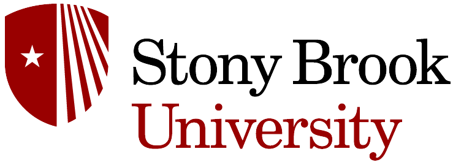
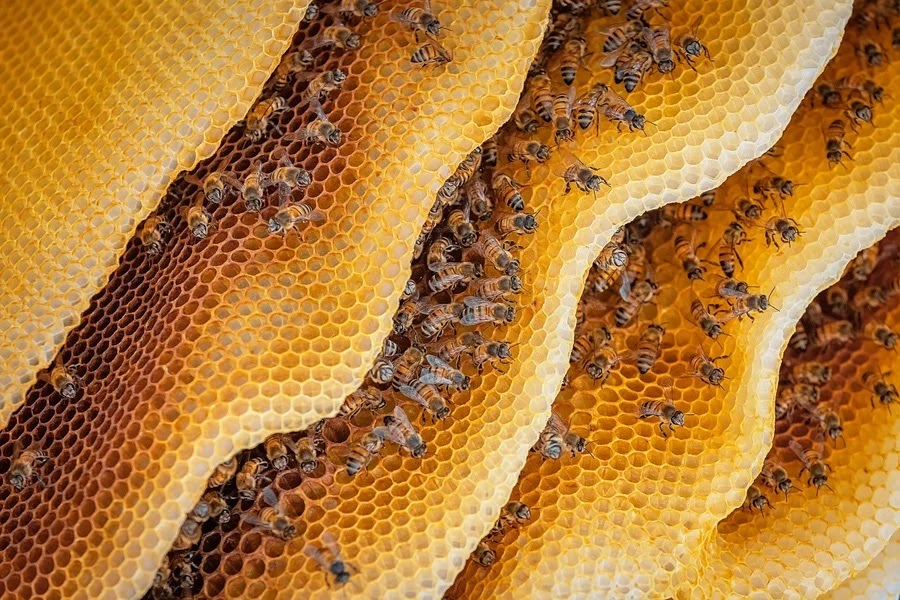

## Evan Lassiter

My GitHub Profile

### Education

I am a [Stony Brook University](https://www.stonybrook.edu/) alumnus with a Bachelor of Science in [Human Evolutionary Biolgy](https://www.stonybrook.edu/commcms/anthropology/undergraduate/bs-human-evolutionary-biology) and a minor in [Geospatial Science](https://www.stonybrook.edu/commcms/gss/index.html).

### Welcome to my GitHub! 👋

- 🔭 I’m currently working on my new geospatial project based in QGIS

- 🌱 I’m currently learning Python programming for spatial datasets

- 👯 I’m looking to collaborate on any large-scale projects implementing environmental risk analysis and disaster management

- 💬 Ask me about my GIS and Remote sensing projects found on my [portfolio](https://speedtortoise347.github.io/)

- 📫 How to reach me:

  - email: evanlassiter00@gmail.com
  - LinkedIn: [My Profile](https://www.linkedin.com/in/evan-lassiter-1258831ba/)

- 😄 Pronouns: he/him/his

- ⚡ Fun fact: I am very interested in and am fond of all bee species!

<!--
**speedtortoise347/speedtortoise347** is a ✨ _special_ ✨ repository because its `README.md` (this file) appears on your GitHub profile.

Here are some ideas to get you started:

- 🔭 I’m currently working on ...
- 🌱 I’m currently learning ...
- 👯 I’m looking to collaborate on ...
- 🤔 I’m looking for help with ...
- 💬 Ask me about ...
- 📫 How to reach me: ...
- 😄 Pronouns: ...
- ⚡ Fun fact: ...
-->
